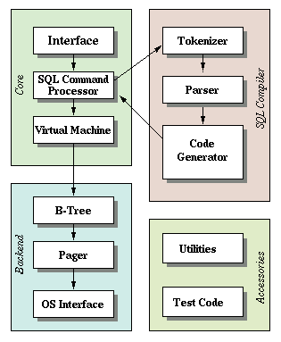

# Notes

## Introduction and Setting up the REPL

### How Does a Database Work?

- What format is data saved in? (in memory and on disk)
- When does it move from memory to disk?
- Why can there be only one primary key per table?
- How does rolling back a transaction work?
- How are indexes formatted?
- When and how does a full table scan happen?
- What format is a prepared statement saved in?

Project: build a [sqlite](https://www.sqlite.org/arch.html) clone from scratch in Go, porting this process documented by [cstack](https://cstack.github.io/db_tutorial/)

> What I cannot create, I do not understand. - Richard Feynman

### Sqlite

Documentation: [sqlite internals](https://www.sqlite.org/arch.html)

A query goes through a chain of components in order to retrieve or modify data. The **front-end** consists of the:

- tokenizer
- parser
- code generator

The input to the front-end is a SQL query. The output s sqlite virtual machine bytecode (essentially a compiled program that can operate on the database).

The **back-end** consists of the:

- virtual machine
- B-tree
- pager
- os interface

The **virtual machine** takes bytecode generated by the front-end as instructions. It can then perform operations on one or more tables or indexes, each of which is stored in a data structure called a B-tree. The VM is essentially a big switch statement on the type of bytecode instruction.

Each **B-tree** consists of many nodes. Each node is one page in length. The B-tree can retrieve a page from disk or save it back by issuing commands to the pager.

The **pager** receives commands to read or write pages of data. It is responsible for reading/writing at appropriate offsets in the database file. It also keeps a cache of recently-accessed pages in memory, and determines when those pages need to be written back to disk.

The **os interface** is the later that differs depending on which operating system sqlite was compiled for.

## World's Simplest SQL Compiler and Virtual Machine

We're making a clone of sqlite. The front-end of sqlite is a SQL compiler that parses a string and outputs an internal representation called bytecode. This bytecode is passed to the virtual machine, which executes it.

Breaking things into two steps like this has a couple advantages:

- reduces the complexity of each part (e.g. virtual machine does not worry about syntax errors)
- allows compiling common queries once and caching the bytecode for improved performance
